# 4TRK

A retro 4-track pattern sequencer for making beats, melodies, and full songs.

> **Early Access** -- 4TRK is under active development. Features may change, and you may encounter rough edges. Feedback and bug reports are welcome!

Press `?` on any screen in the app for instant help. Click **TUT** to start a guided walkthrough.

### Install

Download the zip for your OS, extract, and run.

- **macOS** -- double-click `4TRK.app` (first launch: right-click -> Open, or System Settings -> Privacy & Security -> Open Anyway)
- **Windows** -- run `4TRK.exe`
- **Linux** -- run `./4TRK` (needs PortAudio: `apt install libportaudio2` / `dnf install portaudio` / `pacman -S portaudio`)

---

## Contents

1. [The Main Screen](#1-the-main-screen)
2. [Your First Beat](#2-your-first-beat)
3. [Adding a Melody](#3-adding-a-melody)
4. [Playing Notes Live](#4-playing-notes-live)
5. [Shaping Your Sounds](#5-shaping-your-sounds)
6. [Per-Step Drum FX](#6-per-step-drum-fx)
7. [The Tape Deck](#7-the-tape-deck)
8. [Building a Song](#8-building-a-song)
9. [The Mixer](#9-the-mixer)
10. [Polyrhythms & Extended Patterns](#10-polyrhythms--extended-patterns)
11. [Arpeggiator & Randomizer](#11-arpeggiator--randomizer)
12. [Exporting Your Music](#12-exporting-your-music)
13. [MIDI & Gamepads](#13-midi--gamepads)
14. [Launchpad Mini MK3](#14-launchpad-mini-mk3)
15. [Tips & Tricks](#15-tips--tricks)
16. [Keyboard Shortcuts](#16-keyboard-shortcuts)
17. [Troubleshooting](#17-troubleshooting)
18. [Glossary](#18-glossary)

---

## 1. The Main Screen

When you launch 4TRK, a short CRT boot animation plays, then you land on the main grid. This is where everything happens.

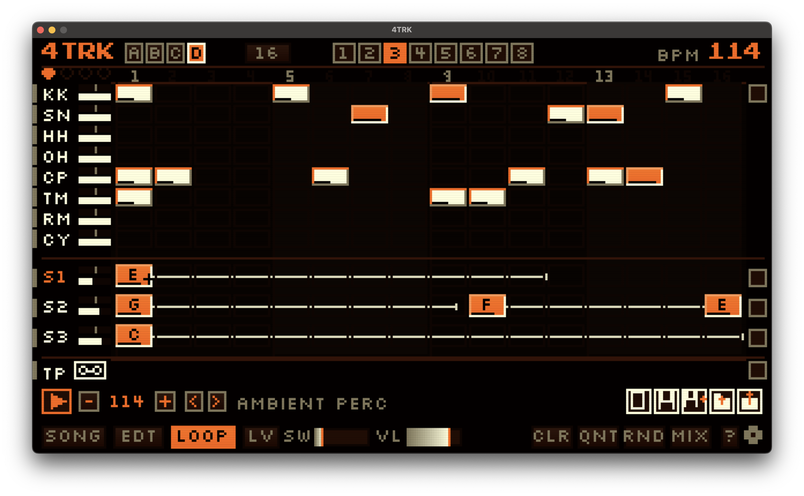
*The main grid: 8 drum rows, 3 synth tracks, tape track, header and footer controls.*

### Header

- **4TRK** logo
- **A B C D** -- pattern banks (8 patterns each = 32 total)
- **[16]** -- step count badge. Click to extend to 32 or 64 steps
- **1-8** -- pattern buttons. Click to switch patterns
- **120** -- current BPM

### Drum Rows (KK - CY)

8 drum tracks. Each cell is a 16th-note step. The labels are: KK (kick), SN (snare), HH (closed hihat), OH (open hihat), CP (clap), TM (tom), RM (rim), CY (cymbal).

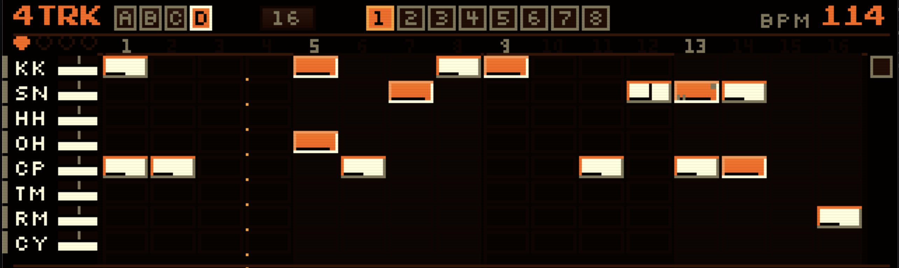
*Drum cells cycle through: off, soft hit (dim), hard hit (bright). Mute/solo bars on the left edge.*

### Synth Rows (S1, S2, S3)

3 polyphonic synth tracks. Cells show note names when notes are placed. Click a cell to open the piano roll.

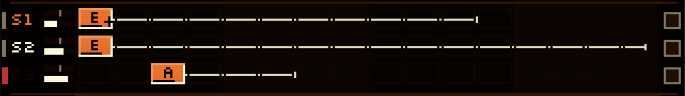
*Synth rows with placed notes. Each cell shows the note name; click to open the piano roll.*

### Tape Track (TP)

Shows a cassette icon and the waveform of recorded audio. Click to open the tape deck.

### Footer

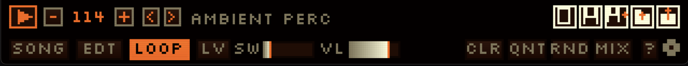
*Footer: transport, BPM, kit browser, file operations (top row), song/utility controls (bottom row).*

- **Transport:** play button, BPM controls (click the number for tap tempo)
- **Kit selector:** browse drum kits with < > arrows
- **File buttons:** NEW, SAVE, SAVE AS, LOAD, EXPORT (WAV)
- **SONG / EDT / LOOP:** song mode, song arranger, loop toggle
- **LV:** LIVE mode (synth params stay locked across patterns)
- **SW:** swing amount -- **VL:** master volume
- **LEN / CLR / QNT / RND / MIX:** length, clear, quantize, randomize, mixer
- **?** help -- **\*** settings

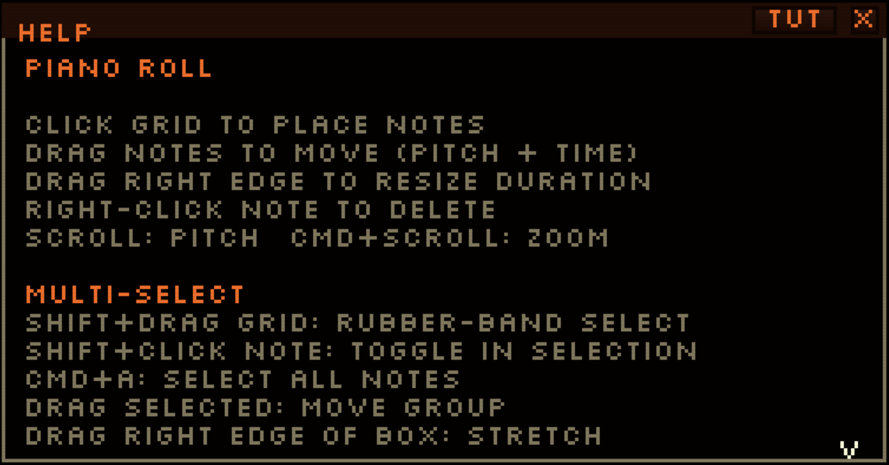
*Press ? on any screen for context-sensitive help. Click TUT to start a guided tutorial.*

### Left-Edge Bars

Between labels and the grid, each drum row has small bars:

- Click the **top bar** to adjust drum pitch
- Click the **bottom bar** to adjust drum volume
- Click the bar itself to **mute**; Shift+click to **solo**

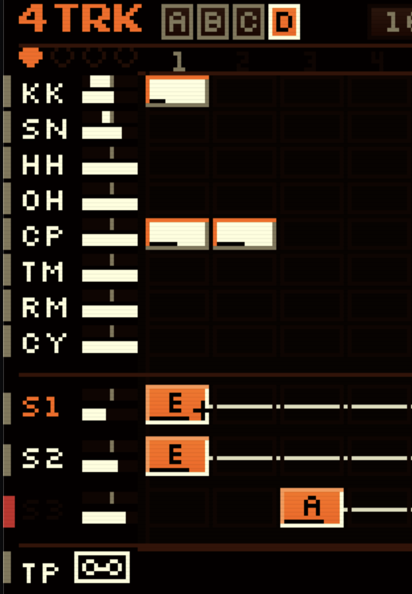

*Left-edge bars: pitch (top), volume (bottom). Click to mute, Shift+click to solo.*

---

## 2. Your First Beat

Let's make a beat in under a minute.

**Step 1: Add a kick drum**

Click cells in the **KK** row on beats 1, 5, 9, and 13 (the downbeats). Each click cycles through: off, soft hit, hard hit. You'll see the cells light up.

**Step 2: Add a snare**

Click cells in the **SN** row on beats 5 and 13 (the backbeat).

**Step 3: Add hihats**

Click every other cell in the **HH** row (1, 3, 5, 7, 9, 11, 13, 15) for 8th-note hihats. Or click every cell for a driving 16th-note pattern.

**Step 4: Press Space to play**

You should hear your beat looping. The playhead moves across the grid highlighting the current step.

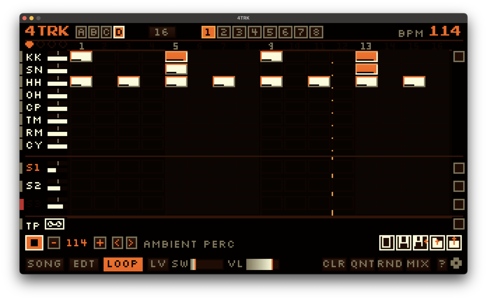
*A basic four-on-the-floor beat with snare backbeat and 8th-note hihats.*

**Step 5: Adjust the tempo**

Click the **+** and **-** buttons around the BPM number to change speed. Or click the BPM number itself repeatedly to **tap tempo**.

**Step 6: Experiment**

- Click a filled cell again to change it from soft to hard hit (or remove it)
- Right-click a drum label (like KK or SN) to open track tools: fill, randomize, set length, or clear
- Try adding hits on CP (clap), TM (tom), RM (rim), and CY (cymbal)

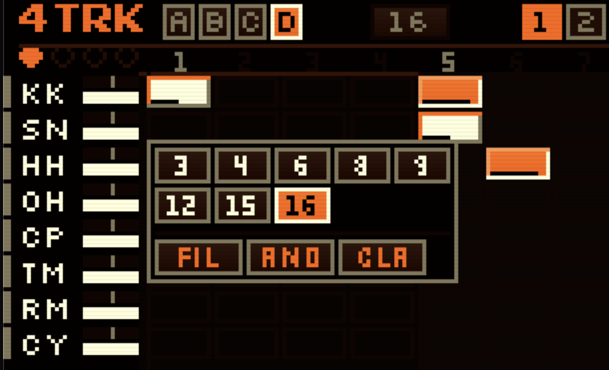
*Right-click a drum label for quick tools: fill patterns, randomize, set track length, or clear.*

**Step 7: Save your work**

Click **SAVE** in the footer. Type a name and press Enter. Your project is saved as a tiny .4trk file.

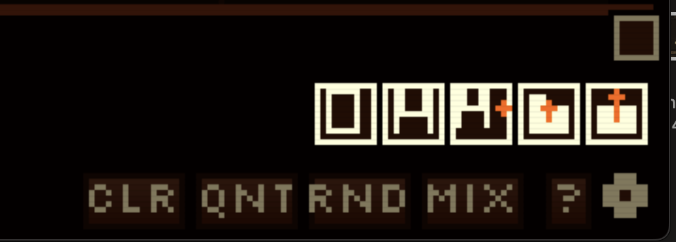

*The file buttons: NEW, SAVE, SAVE AS, LOAD, and EXPORT.*

---

## 3. Adding a Melody

Now let's add some notes on top of your beat.

**Step 1: Open the piano roll**

Click any cell in the **S1** row. The piano roll opens -- a grid with pitch on the vertical axis and time (steps) on the horizontal axis.

**Step 2: Place a note**

Click anywhere on the grid. A note appears. The pitch is determined by the row you click, and the position by the column.

**Step 3: Move and resize notes**

- **Drag a note** to move it (changes both pitch and position)
- **Drag the right edge** of a note to make it longer or shorter
- **Right-click** a note to delete it

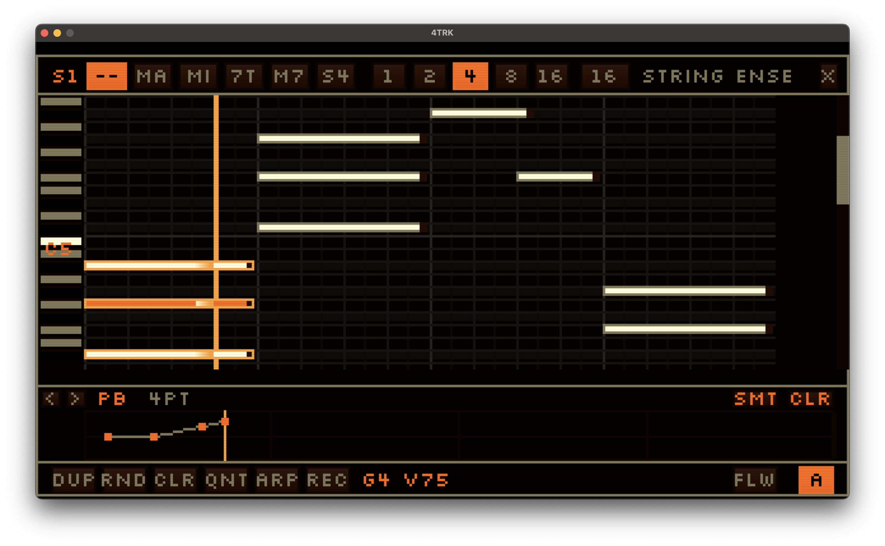
*The piano roll: click to place notes, drag to move, drag right edge to resize.*

**Step 4: Use chord stamps**

The toolbar has chord buttons: **-- MA MI 7T M7 S4** (none, major, minor, 7th, minor 7th, sus4). Select one before clicking to place a full chord.

**Step 5: Set note length**

The toolbar also has length buttons: **1 2 4 8 16** (in steps). Select a length before placing notes.

**Step 6: Listen**

Press `Space` to play. Toggle **FLW** in the bottom toolbar to follow the playhead.

**Other toolbar buttons:**
**DUP** (duplicate first bar),
**RND** (randomize),
**CLR** (clear),
**QNT** (quantize),
**ARP** (arpeggiator),
**REC** (record arm),
**AUT** (per-note automation).

Press `Escape` to close the piano roll and return to the main grid.

---

## 4. Playing Notes Live

Your computer keyboard doubles as a piano. This works on the main grid, in the piano roll, in the synth editor, and in the tape deck.

```
Black Keys (sharps):
  S     D           G     H     J           L
  C#    D#          F#    G#    A#          C#

White Keys:
  Z     X     C     V     B     N     M     ,     .
  C     D     E     F     G     A     B     C     D
```

`[` octave down -- `]` octave up (range: 1-6)

The layout mirrors a real piano: `S` and `D` sit between `Z`, `X`, and `C` just like black keys sit between white keys.

### Recording with the Keyboard

1. Press `1`, `2`, or `3` to arm a synth track for recording (the label flashes red)
2. Press `Space` to start playback
3. Play notes on the keyboard -- they are recorded into the pattern, quantized to the nearest step
4. Press `Space` again to stop

Velocity (how hard the note plays) is controlled with `+` / `-` keys.

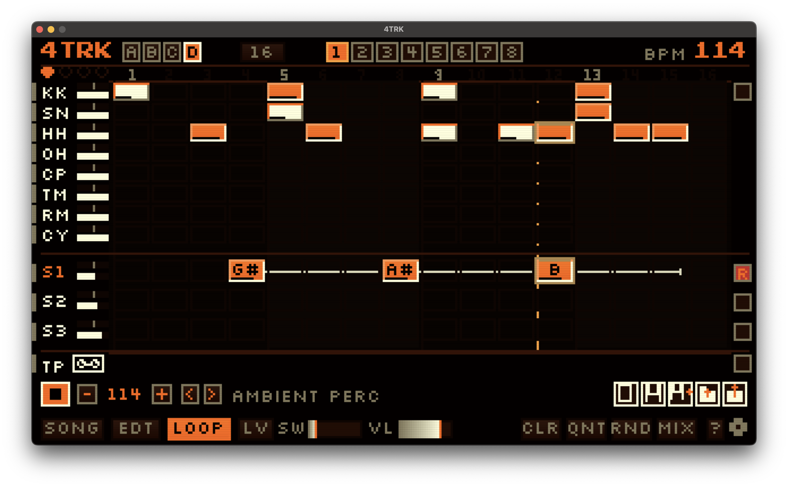
*A synth track armed for recording: the label turns red. Play notes while the pattern loops.*

> **Tip:** If you have a MIDI keyboard or controller plugged in, it's auto-detected and works the same way -- notes are routed to the armed track.

---

## 5. Shaping Your Sounds

### Synth Editor

Click a synth label (**S1**, **S2**, or **S3**) to open the synth editor.

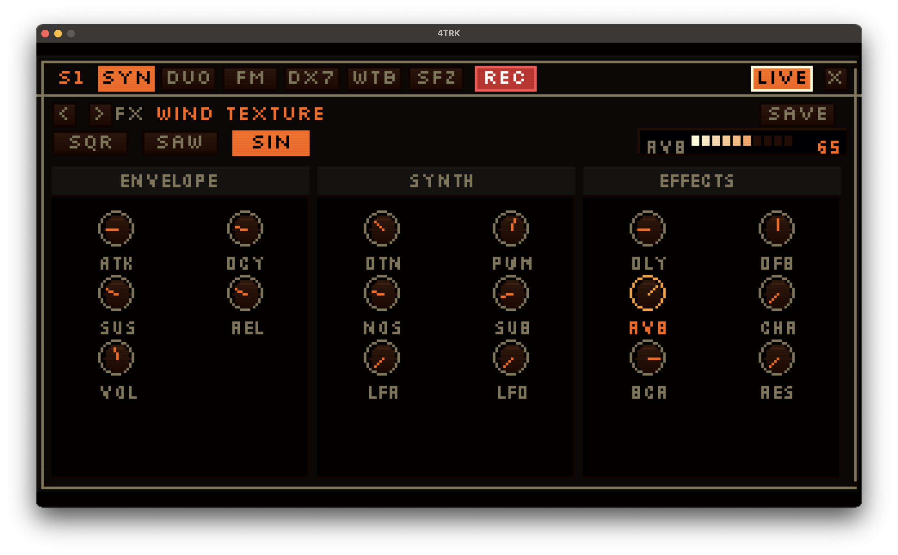
*The synth editor: three rows of knobs, mode tabs at top, preset browser.*

**Synth modes** (press `Tab` to cycle):

| Mode | Name | What it does |
|------|------|--------------|
| SYN | Single Osc | Square/saw/sine + detune, pulse width, sub-osc, noise |
| DUO | Dual Osc | Two oscillators (A+B) with crossfade mix |
| FM | FM Synth | 2-operator FM synthesis -- great for bells, basses, metallic sounds |
| WTB | Wavetable | Morphable wavetable oscillator. Drop custom .wav in ~/Documents/4TRK/wavetables/ |
| SFZ | Sampler | Load sample-based instruments from ~/Documents/4TRK/sfz/ |

**Knob rows:**

- **Row 1:** ATK DCY SUS REL VOL -- the ADSR envelope and volume
- **Row 2:** DLY DTM DFB BCR RVB CHR -- delay, time, feedback, bitcrush, reverb, chorus
- **Row 3:** RES LFR LFD + mode-specific knobs

**Working with knobs:** click and drag up/down to adjust, right-click to reset to default, or use `Left`/`Right` to navigate and `Up`/`Down` to adjust.

**Presets:** Click **<** and **>** to browse 145+ factory presets. Hit **SAVE** to save your own. Browse presets from anywhere with `Cmd`+`Left`/`Right`.

**MIDI learn:** Press `L`, click any knob, then twist a knob on your MIDI controller. The mapping is saved automatically.

### Drum Editor

Click a drum label (**KK**, **SN**, etc.) to open the drum editor.

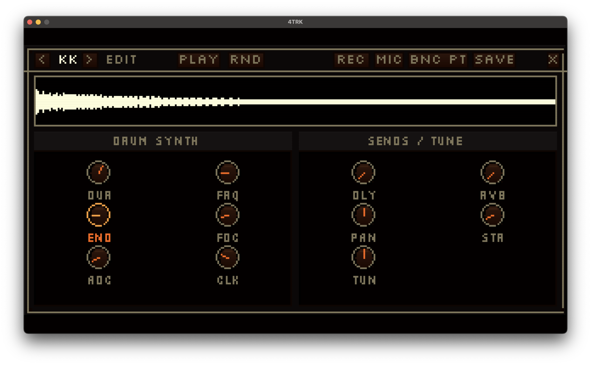
*The drum editor: sample waveform with trim handles, effect bars, recording controls.*

Each drum can be **sample-based** or **synthesized**:

- **Sample mode:** waveform with START/END trim, FX bars (REV, DRV, BIT, LFI, FLT, DCY)
- **Synth mode:** click SYNTH to switch. Fully generated drums with tweakable parameters
- **REC:** record a new sample from mic or internal audio
- **BOUNCE:** render the current drum pattern to a sample. *Note: bouncing a long pattern (e.g. 64 steps) creates a large waveform -- this may be heavy on older machines.*

Shared controls: DLY, RVB, PAN, STR (stereo width), TUN (pitch). Click **SAVE KIT** to save your 8-drum kit.

---

## 6. Per-Step Drum FX

Long-press (hold click) on any drum cell to open the per-step editor:

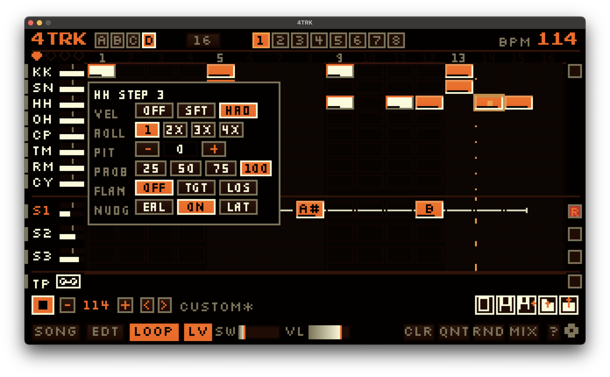
*Per-step drum FX: fine-tune every individual hit.*

| Parameter | What it does |
|-----------|--------------|
| **VEL** | Velocity -- soft or hard hit |
| **ROLL** | Repeat count -- 1x (normal), 2x (double), 4x (roll) |
| **PIT** | Pitch offset per step (semitones) |
| **PROB** | Probability -- 25/50/75/100% chance of playing |
| **FLAM** | Double-hit timing -- off, tight, or loose |
| **NUDG** | Timing offset -- early, on-grid, or late |

> **Tip:** Set hi-hat probability to 75% for a natural feel. Add rolls on snare fills. Use pitch offsets for melodic toms. Nudge kicks slightly late for a laid-back groove.

---

## 7. The Tape Deck

Click the **TP** row to open the tape deck. It records audio and plays it back as a 4th track alongside your drums and synths. Each pattern has its own tape.

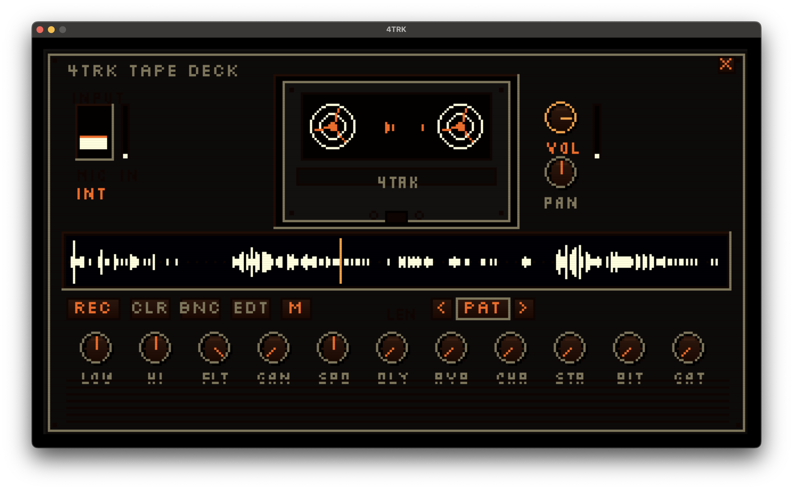
*The tape deck: cassette animation, LCD waveform display, recording and effect controls.*

### Recording

1. Select **MIC** (microphone) or **INT** (internal mix) with the toggle switch
2. Set the recording length (PAT, 4, 8, 16, 32, or 64 steps)
3. Click **REC** -- recording starts with the next playback
4. Press `Space` to play. Recording stops at the set length

**BNC** (bounce): renders the full drum+synth mix to tape offline. Great for resampling or freeing up tracks.

### Tape Effects (13 Knobs)

| Knob | Effect |
|------|--------|
| VOL | Tape volume |
| PAN | Stereo pan |
| LOW / HI | Low and high shelf EQ |
| FLT | Lowpass filter |
| GAN | Drive / saturation |
| SPD | Playback speed / pitch |
| DLY / RVB / CHR | Delay, reverb, chorus sends |
| STR | Stereo width |
| BIT | Bitcrush |
| GAT | Noise gate |

### Tape Editor / Slicer

Click **EDT** to open the tape editor. Drag on the waveform to select a region, then use the operation buttons:

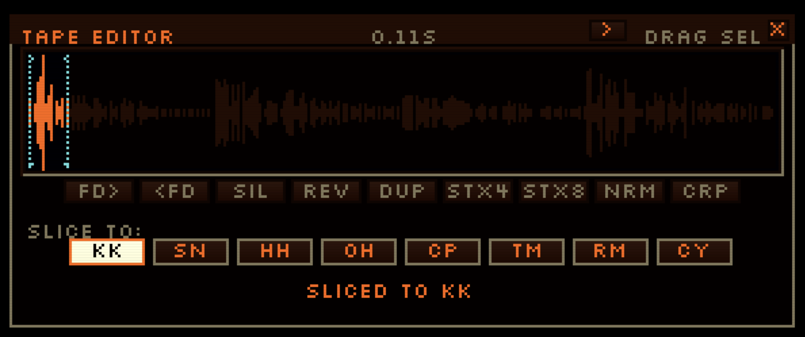
*The tape slicer: select a region, apply wave operations, or slice audio to drum slots.*

Operations: **FD>** (fade in), **<FD** (fade out), **SIL** (silence), **REV** (reverse), **DUP** (duplicate), **STx4 / STx8** (stutter), **NRM** (normalize), **CRP** (crop).

**Slice to drum:** Click a drum slot (KK, SN, etc.) below the waveform to send the selected audio to that drum -- instant custom samples.

> **Heads up:** Slicing a long region to a drum slot creates a large sample that plays back on every trigger. Bouncing a long pattern or song to tape also produces a large waveform. Both can be heavy on older machines, so if you're seeing performance issues, try working with shorter regions.

---

## 8. Building a Song

### Patterns

4TRK has 32 patterns in 4 banks: **A, B, C, D** (8 each). Each pattern stores drum hits, synth notes, tape audio, sound settings, and track lengths independently.

- Click **pattern buttons 1-8** to switch
- Click **bank buttons A-D** to change banks
- `Shift`+`Left`/`Right` to step through patterns
- `Cmd`+`C` / `Cmd`+`V` to copy and paste

### Song Arranger

Click **EDT** in the footer to open the song arranger. Chain patterns into a full arrangement.

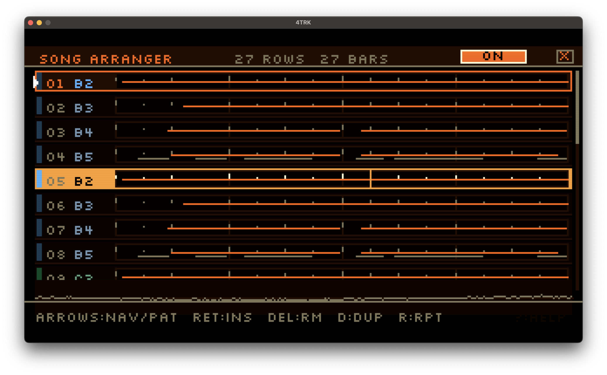
*The song arranger: chain patterns with repeats and loop regions.*

| Key | Action |
|-----|--------|
| `Up` / `Down` | Navigate rows |
| `Left` / `Right` | Change pattern number |
| `Enter` | Insert new row |
| `Delete` | Remove row |
| `D` | Duplicate row |
| `R` | Cycle repeat count (1-4x) |
| `L` | Set loop start / end |

### Song Mode & LIVE Mode

Click **SONG** to enable song mode, then press `Space` to play through the arrangement. Enable **LOOP** to loop the region set with `L`.

Click **LV** for LIVE mode -- synth parameters stay locked across pattern changes, perfect for performing.

---

## 9. The Mixer

Click **MIX** in the footer to open the mixer.

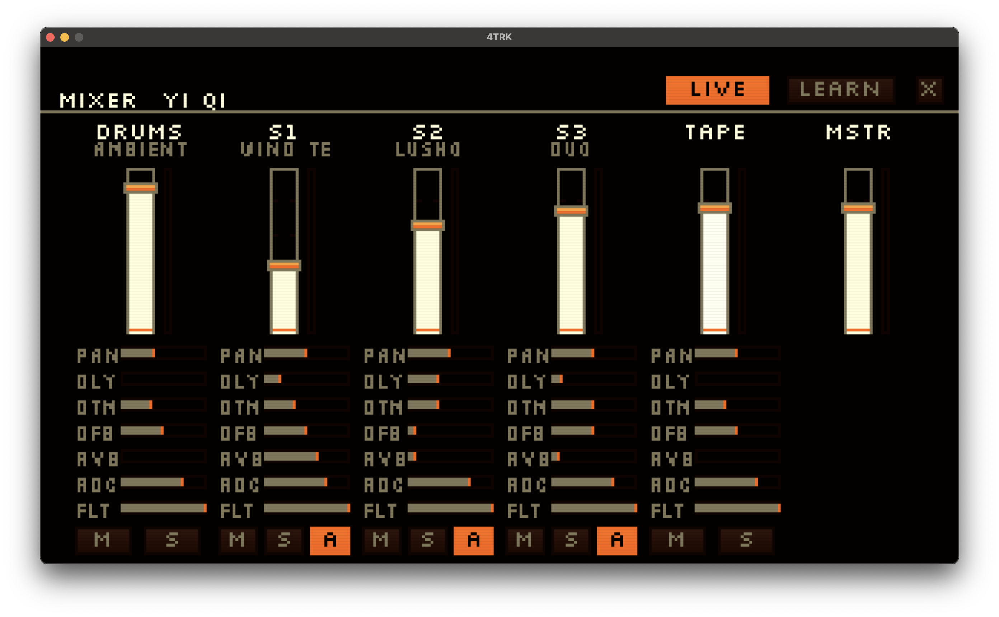
*The mixer: 6 channels with volume faders, effect sends, and mute/solo.*

6 channels: **DRUMS**, **S1**, **S2**, **S3**, **TAPE**, **MSTR** (master).

Each channel has: volume fader with VU meter, **DLY** (delay send/time/feedback), **RVB** (reverb send/decay), **FLT** (filter cutoff), **M** (mute), **S** (solo).

Click a channel label to jump to that track's editor. **MSTR** controls the final output.

---

## 10. Polyrhythms & Extended Patterns

**Extending all tracks:** Click the **step count badge** [16] in the header to cycle through 16, 32, and 64 steps. Or click **LEN** in the footer.

**Per-track lengths (polyrhythms):** Right-click a track label and choose a different length. For example: a 12-step hi-hat over a 16-step kick creates a shifting, evolving pattern that takes 48 steps to fully repeat.

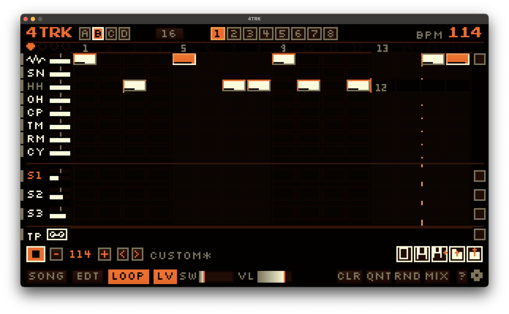
*Polyrhythms: different track lengths create evolving patterns.*

When patterns exceed 16 steps, page dots appear above the grid. Click them or press `` ` `` (backtick) to switch pages.

---

## 11. Arpeggiator & Randomizer

### Arpeggiator

Open the piano roll, then click **ARP** in the bottom toolbar.

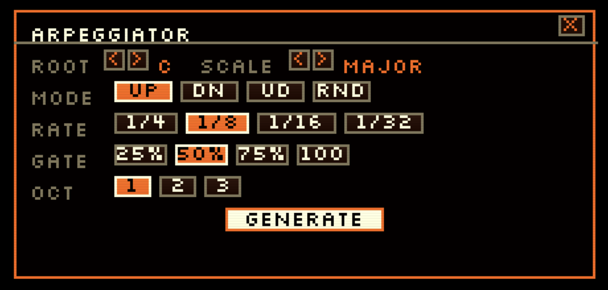
*The arpeggiator: choose mode, rate, scale, and generate a pattern.*

| Control | Options |
|---------|---------|
| Mode | UP, DN (down), UD (up-down), RND (random) |
| Rate | 1/4, 1/8, 1/16, 1/32 notes |
| Gate | 25%, 50%, 75%, 100% (note length) |
| Octaves | 1, 2, or 3 octave range |
| Scale | Major, Minor, Pentatonic, Blues, Dorian, Phrygian, Mixolydian, Harmonic Minor |

Click **GENERATE** to write the arpeggio pattern directly into the track.

### Randomizer

Click **RND** on the main grid for drums, or in the piano roll for melodies. Drum randomization uses musical weighting; melody randomization is scale-aware with humanized velocity.

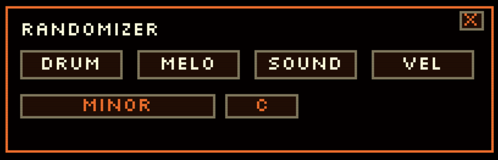
*The randomizer: scale-aware note generation with density control.*

---

## 12. Exporting Your Music

Click the **EXP** button (rightmost file button in the footer) to export to WAV.

- In **pattern mode**: exports the current pattern (one loop)
- In **song mode**: exports the full song arrangement

The output is a 44100Hz 16-bit stereo WAV file. Type a filename and press Enter.

> **Tip:** Bounce your mix to tape first (open tape deck, click BNC), then export. This lets you add tape effects to the final master.


*Type a filename and press Enter to export your pattern or song to WAV.*

---

## 13. MIDI & Gamepads

### MIDI Controllers

Plug in a MIDI keyboard or controller -- 4TRK auto-detects it. Select the device in Settings (gear icon) if you have multiple.

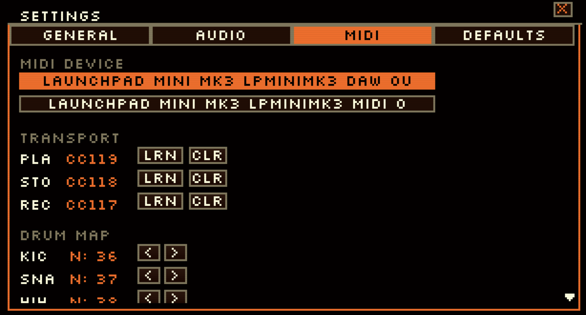
*Settings: select MIDI device, choose theme, configure buffer size and other options.*

- MIDI keyboard notes are routed to the active synth track
- Arm a track with `1`/`2`/`3` for recording
- MIDI drum notes (36-43, General MIDI) trigger the 8 drum sounds

### MIDI Learn

1. Press `L` to enter MIDI learn mode
2. Click any knob or fader in the app
3. Twist a knob on your MIDI controller
4. Done -- mapping saved to ~/Documents/4TRK/midi_map.json

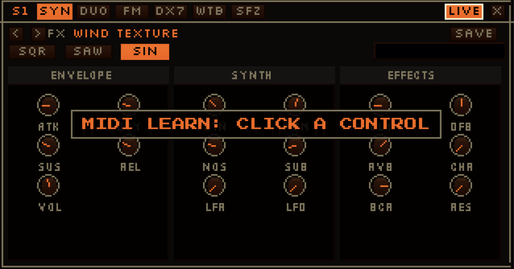
*MIDI learn: press L, click a control, twist a knob on your hardware.*

### MIDI Transport

Hardware transport buttons work automatically: CC 119 (play/stop), CC 118 (stop), CC 117 (record arm).

### Gamepad (Early / Limited)

4TRK has basic gamepad support for Xbox and PlayStation-style controllers. This is currently limited to grid navigation and basic editing -- expanded gamepad controls are planned for a future update.

| Button | Main Grid | Editors |
|--------|-----------|---------|
| **A** | Toggle step / confirm | Confirm |
| **B** | Delete / back | Close popup |
| **X** | Hold for transpose | -- |
| **Y** | Open editor / hold for solo-mute | Cycle synth mode |
| **D-pad** | Move cursor | Navigate params |
| **LB / RB** | Prev / next synth track | Prev / next preset |
| **Start** | Play / Stop | Play / Stop |
| **Back** | Song arranger | Hold Start: undo |

---

## 14. Launchpad Mini MK3

4TRK has built-in support for the **Novation Launchpad Mini MK3**. Plug it in and 4TRK auto-detects it -- no configuration needed. The Launchpad is a companion controller; the app works fully without it.

The Launchpad provides five modes, each with its own pad layout, LED colours, and scene-column functions. Mode buttons along the top row switch between them.

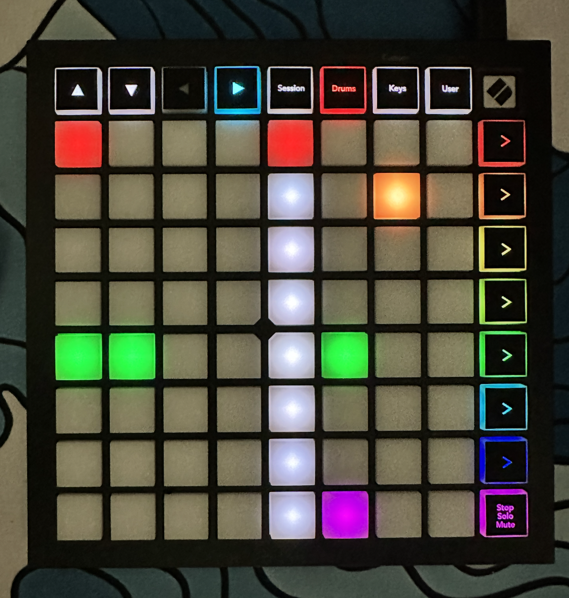

*Launchpad Mini MK3 in Drums mode. Each row is colour-coded to a drum sound.*

### Global Controls (all modes)

| Button / Chord | Action |
|----------------|--------|
| Tap **Session** | Session mode (pattern launcher) |
| Tap **Drums** | Drums sequencer mode |
| Tap **Keys** | Live Keys mode (live synth keyboard) |
| Hold **User** | Shift modifier |
| User + **Drums** | Live Drums mode (velocity-sensitive pads) |
| User + **Keys** | Keys sequencer mode (step-edit synth notes) |
| User + **Up** | Play / Pause |
| User + **Down** | Stop |
| User + **Left** | Toggle record arm |
| User + **Right** | Toggle auto-follow (pages track the playhead) |

### Drums Mode

Step sequencer for the 8 drum sounds. The 8x8 grid shows drum rows (top to bottom: KK, SN, HH, OH, CP, TM, RM, CY) x steps within the current page.

| Control | Action |
|---------|--------|
| Tap pad | Cycle step: off -> soft -> hard -> off |
| **Left** / **Right** | Page through steps (for 16+ step patterns) |
| **Up** / **Down** | Previous / next pattern |
| Scene column | Toggle per-row drum mute |
| Shift + scene | Clear that drum row (all steps, params reset) |

### Keys Mode (Shift+Keys)

Step sequencer for synth notes. The grid shows 8 pitches (top = highest) x 8 steps. Notes placed use the currently selected sustain length.

| Control | Action |
|---------|--------|
| Tap pad | Toggle a note at that step + pitch |
| **Left** / **Right** | Page through steps |
| **Up** / **Down** | Cycle active synth track (S1 -> S2 -> S3) |
| Scene 1-6 | Sustain picker: 1/4, 1/2, 1, 2, 4, 8 steps |
| Scene 7 / 8 | Pitch scroll down / up |
| Shift + Scene 1-3 | Clear synth track 1/2/3 events |
| Shift + Scene 4 / 5 | Preset prev / next |
| Shift + Scene 6 / 7 | Scale prev / next |

### Live Keys Mode (tap Keys)

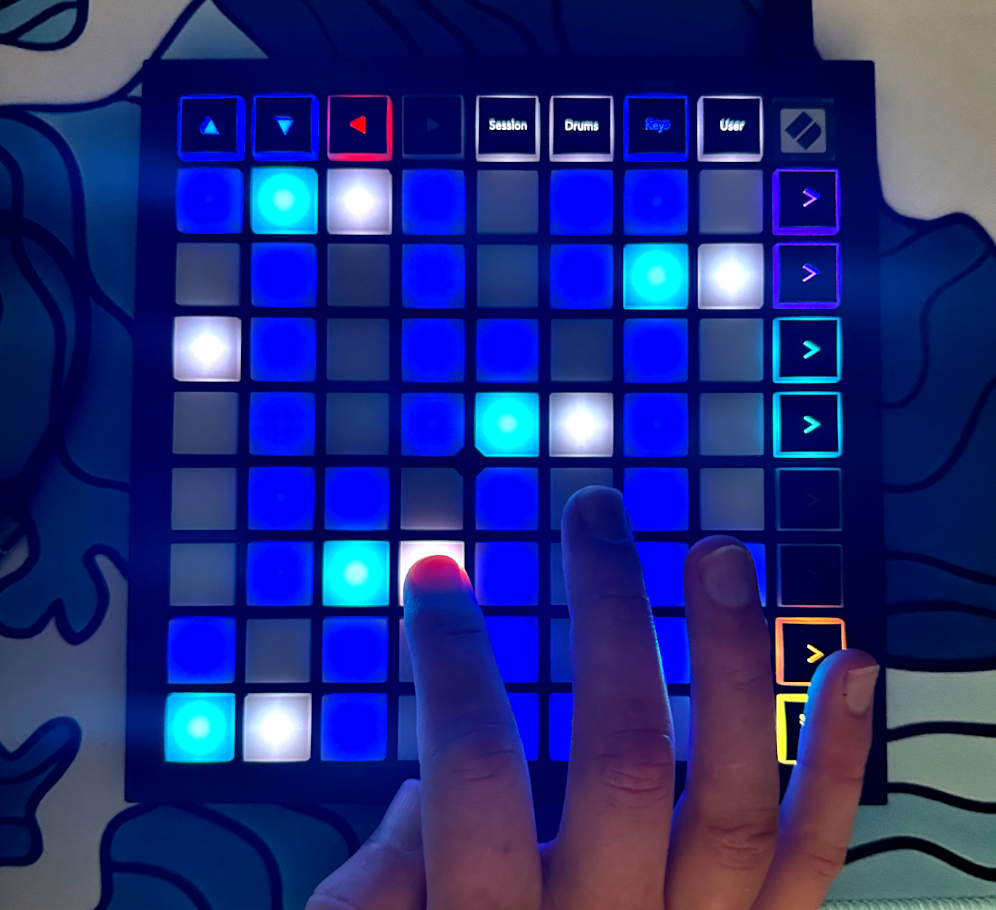

*Live Keys: isomorphic keyboard layout. Cyan pads mark root notes (C); white pads light up when played.*

Velocity-sensitive isomorphic keyboard for live playing and recording. Within a row, each pad steps up by one pitch (semitone or scale degree). Each row above adds a 4th (5 semitones / 3 scale degrees) -- chord shapes translate anywhere on the grid.

| Control | Action |
|---------|--------|
| Tap pad | Note on (velocity-sensitive); release = note off |
| **Up** / **Down** | Cycle active synth track |
| **Left** | Toggle record arm for the active track |
| Scene 1 / 2 | Scale prev / next |
| Scene 3 / 4 | Preset prev / next |
| Scene 7 / 8 | Pitch scroll down / up |
| Shift + Scene 1-3 | Clear synth track 1/2/3 events |

When record-armed and the sequencer is running, played notes are punched into the pattern with duration captured from press-to-release.

### Live Drums Mode (User+Drums)

Velocity-sensitive drum pads for live playing, plus per-sample parameter nudge controls.

| Region | Action |
|--------|--------|
| Bottom-right 2x4 pads | Drum play pads (velocity-sensitive, 8 drums) |
| Top 4 rows | Per-sample param nudge: A-, A+, B-, B+ (default: A=pitch, B=volume) |
| Scene column | Toggle per-drum mute |
| **Up** / **Down** | Previous / next pattern |

### Session Mode

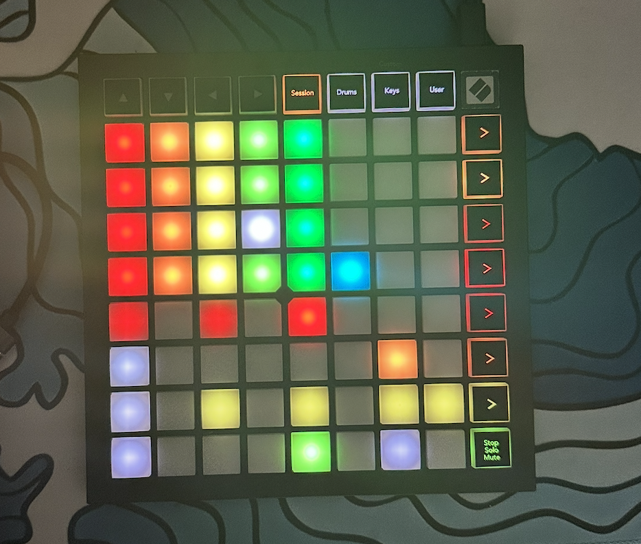

*Session mode: pattern launcher (top) with live mini-view (bottom). Hold scene pads for beat repeat.*

Pattern launcher with a live mini-view of the current pattern.

| Region | Action |
|--------|--------|
| Top 4 rows (32 slots) | Tap to jump to a pattern. Colour shows density; white = active |
| Bottom 4 rows | Read-only mini-view of current pattern (drum lanes or synth tracks) |
| Scene 1-4 | Beat repeat: hold to shrink loop (/8, /4, /2, /1). Release to restore |
| Shift + Scene 5 | Toggle tape record |
| Shift + Scene 6 | Toggle tape source (MIC / INT) |
| Shift + Scene 7 | Toggle tape mute |
| Shift + Scene 8 | Clear tape |

---

## 15. Tips & Tricks

- `Cmd`+`Z` undoes almost everything -- pattern edits, knob changes, note moves
- `Cmd`+`C` / `Cmd`+`V` copies and pastes entire patterns between slots
- `Cmd`+`Left`/`Right` shifts all pattern steps left or right
- **Shift+click** a mute bar to solo that track
- **Right-click any knob** to reset it to default
- `P` toggles preview sounds -- hear notes as you place them
- `Shift`+`T` cycles through 32 built-in themes. Make your own by dropping a .json file in ~/Documents/4TRK/themes/

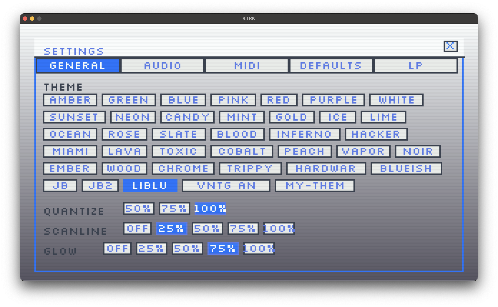
*32 built-in themes. Press Shift+T to cycle, or drop custom .json files in ~/Documents/4TRK/themes/.*

- Projects are tiny (~2-5KB compressed JSON) -- easy to share or back up
- Custom wavetables: drop .wav files into ~/Documents/4TRK/wavetables/ (single-cycle or Serum-format)
- SFZ instruments: drop .sfz instrument folders into ~/Documents/4TRK/sfz/
- The app ships with demo projects -- click LOAD to explore them

---

## 16. Keyboard Shortcuts

### Global (work on every screen)

| Key | Action |
|-----|--------|
| `Space` | Play / Stop |
| `Cmd`+`Z` | Undo |
| `Cmd`+`C` | Copy current pattern |
| `Cmd`+`V` | Paste pattern |
| `Cmd`+`Left`/`Right` | Previous / next preset |
| `1` / `2` / `3` | Arm synth track 1/2/3 for recording |
| `4` | Record to tape (internal) |
| `5` | Record to tape (microphone) |
| `0` | Mute / unmute tape track |
| `L` | Toggle MIDI learn mode |
| `Shift`+`T` | Cycle visual theme |
| `Shift`+`?` | Open help overlay |
| `F11` / `Shift`+`F` | Toggle fullscreen |
| `P` | Toggle preview sounds |
| `Escape` | Close popup / back |

### Main Grid

| Key | Action |
|-----|--------|
| `Up` `Down` `Left` `Right` | Move step cursor |
| `Enter` | Toggle drum hit / open piano roll on synth row |
| `R` | Cycle drum repeat (1x/2x/4x) or arm synth for recording |
| `Delete` | Remove note or drum hit at cursor |
| `Tab` | Cycle active synth track (S1 -> S2 -> S3) |
| `` ` `` | Cycle grid page |
| `[` / `]` | Change keyboard octave |
| `+` / `-` | Increase / decrease velocity |
| `A` | Toggle arpeggiator on active synth track |
| `Shift`+`A` | Cycle arpeggiator mode (UP/DN/UD/RND) |
| `Cmd`+`Left`/`Right` | Shift pattern steps left/right |
| `Shift`+`Left`/`Right` | Switch to previous/next pattern |
| `Z`-`M` / `S`-`K` | Play notes on keyboard piano |

### Piano Roll

| Key / Action | What it does |
|--------------|--------------|
| Click grid | Place note |
| Drag note | Move (pitch + time) |
| Drag right edge | Resize duration |
| Right-click note | Delete note |
| `Shift`+drag grid | Rubber-band select |
| `Shift`+click note | Toggle in selection |
| `Cmd`+`A` | Select all notes |
| `D` | Duplicate selection |
| `Delete` | Delete selected notes |
| `Up` / `Down` | Scroll view (pitch) |
| `Left` / `Right` | Scroll view (time) |
| `Shift`+`Up`/`Down` | Transpose semitone |
| `Cmd`+`Up`/`Down` | Transpose octave |
| `Shift`+`Left`/`Right` | Nudge note position |
| `Cmd`+scroll | Zoom in / out |
| `+` / `-` | Adjust velocity |
| `[` / `]` | Change keyboard octave |
| `R` | Toggle record arm |

### Synth Editor

| Key | Action |
|-----|--------|
| `Left` / `Right` | Navigate knobs |
| `Up` / `Down` | Adjust focused knob |
| `Tab` | Cycle synth mode (SYN/DUO/FM/WTB/SFZ) |
| `R` | Toggle record arm |
| `[` / `]` | Change keyboard octave |
| `Z`-`M` / `S`-`K` | Play notes on keyboard |
| `L` | MIDI learn (click knob, twist CC) |

### Drum Editor

| Key | Action |
|-----|--------|
| `Up` / `Down` | Navigate parameters |
| `Left` / `Right` | Adjust focused parameter |
| `Space` | Preview drum sound |

### Tape Deck

| Key | Action |
|-----|--------|
| `Left` / `Right` | Navigate knobs |
| `Up` / `Down` | Adjust focused knob |
| `Z`-`M` / `S`-`K` | Play notes on keyboard |

### Song Arranger

| Key | Action |
|-----|--------|
| `Up` / `Down` | Navigate rows |
| `Left` / `Right` | Change pattern number |
| `Enter` | Insert new row |
| `Delete` | Remove row |
| `D` | Duplicate row |
| `R` | Cycle repeat count (1-4x) |
| `L` | Set loop start / end |
| `P` | Play from cursor |
| `Space` | Play / Stop |

### Mouse Actions

| Action | What it does |
|--------|--------------|
| Click drum cell | Cycle: off -> soft -> hard |
| Long-press drum cell | Open per-step FX editor |
| Right-click drum cell | Remove hit |
| Click synth cell | Open piano roll |
| Right-click synth cell | Delete events at step |
| Click track label | Open sound editor |
| Right-click track label | Track tools / set length |
| Click mute bar | Toggle mute |
| Shift+click mute bar | Toggle solo |
| Drag knob up/down | Adjust parameter |
| Right-click knob | Reset to default |
| Scroll wheel (piano roll) | Scroll pitch |
| Cmd+scroll (piano roll) | Zoom |

### Gamepad

| Button | Main Grid | Editors |
|--------|-----------|---------|
| **A** | Toggle step | Confirm |
| **B** | Delete / back | Close |
| **X** | Hold: transpose | -- |
| **Y** | Open editor | Cycle mode |
| **D-pad** | Move cursor | Navigate |
| **LB / RB** | Prev / next track | Prev / next preset |
| **Start** | Play / Stop | Play / Stop |
| **Back** | Song arranger | Hold Start: undo |

---

## 17. Troubleshooting

### Audio Crackling / Dropouts

Crackling or glitchy audio usually means the audio buffer is too small for your system to keep up. This is most common on **Linux** (PulseAudio / PipeWire) but can happen on any platform under heavy CPU load.

**Fix:** Open Settings (gear icon) -> Audio tab -> increase the **Buffer** size. Start with 512; if crackling persists, try 1024. Larger buffers add a small amount of latency but eliminate dropouts.

| Buffer Size | Latency | Best For |
|-------------|---------|----------|
| 128 | ~3 ms | Fast machines, macOS CoreAudio |
| 256 (default) | ~6 ms | Most macOS / Windows setups |
| 512 | ~12 ms | Linux, older machines, or heavy projects |
| 1024 | ~23 ms | Fallback for persistent issues |

### No Sound

- Check that the correct **output device** is selected in Settings -> Audio tab. "AUTO" uses the system default.
- Make sure tracks are not muted -- click the coloured bars on the left edge of the main grid to unmute.
- If sound disappears after unplugging headphones or switching audio devices, 4TRK will try to recover automatically. If it doesn't, restart the app.

### MIDI Controller Not Detected

- Open Settings (gear icon) and check the MIDI device list. Click your device to select it.
- If your device doesn't appear, make sure it's plugged in *before* launching 4TRK, or restart the app after connecting.
- On Linux, ensure your user has permission to access MIDI devices (typically the `audio` group).

### High CPU Usage

- DX7 (FM) synth voices are the most CPU-intensive. If a project is struggling, switch one or more synth tracks to a lighter engine (Synth, Dual, or Wavetable).
- Reduce the number of active tracks or mute tracks you're not using.
- Increase the audio buffer size -- larger buffers give the CPU more time per callback.

### Linux-Specific Notes

- **PipeWire** generally offers better low-latency performance than PulseAudio. If your distro supports it, switching to PipeWire may help with audio quality.
- If you get a "PortAudio" error on launch, install the `libportaudio2` package (or equivalent for your distro).
- SDL2 is required for the display. Install `libsdl2-dev` if you see import errors.

---

## 18. Glossary

| Term | Meaning |
|------|---------|
| **Pattern** | A loop of up to 64 steps containing drum hits, synth notes, and tape audio |
| **Step** | One 16th-note time division in the sequencer |
| **Bank** | A group of 8 patterns (A, B, C, D = 32 total) |
| **ADSR** | Attack, Decay, Sustain, Release -- the shape of a sound over time |
| **FM Synthesis** | Frequency Modulation -- one oscillator modulates another for complex timbres |
| **Wavetable** | A set of single-cycle waveforms that can be morphed between |
| **SFZ** | A sample-based instrument format (folder of .wav files + .sfz definition) |
| **Polyrhythm** | Different tracks running at different lengths, creating shifting patterns |
| **Swing** | Delays every other step slightly for a shuffle/groove feel |
| **Quantize** | Snap recorded notes to the nearest grid position |
| **Bounce** | Render audio offline (e.g., mix to tape, export to WAV) |
| **Slice** | Cut a section of tape audio and assign it to a drum slot |
| **MIDI CC** | MIDI Control Change -- a knob/fader message from a hardware controller |
| **MIDI Learn** | Map a physical MIDI CC to a software parameter by example |
| **LIVE mode** | Synth parameters persist when switching patterns (for performance) |
| **Song mode** | Play patterns in sequence as defined in the song arranger |
| **Arm** | Enable a track for live recording (track label flashes red) |
